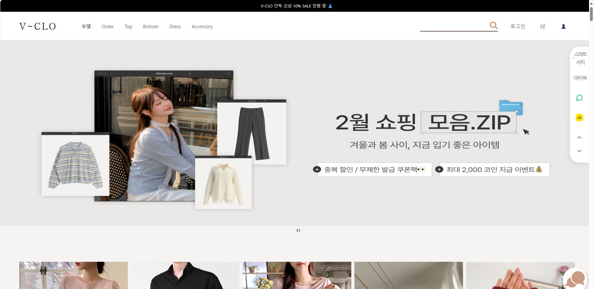
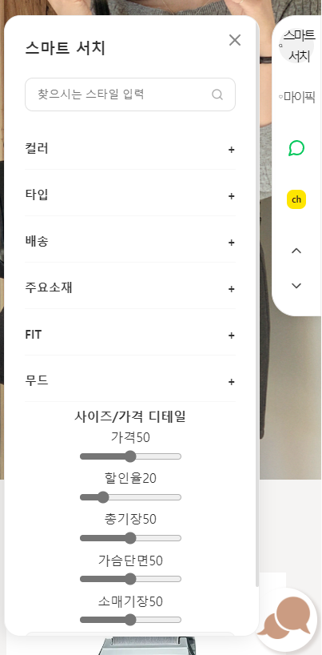
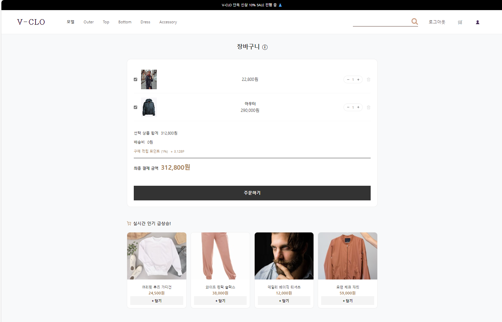
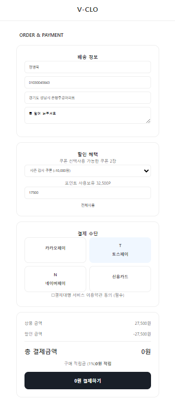
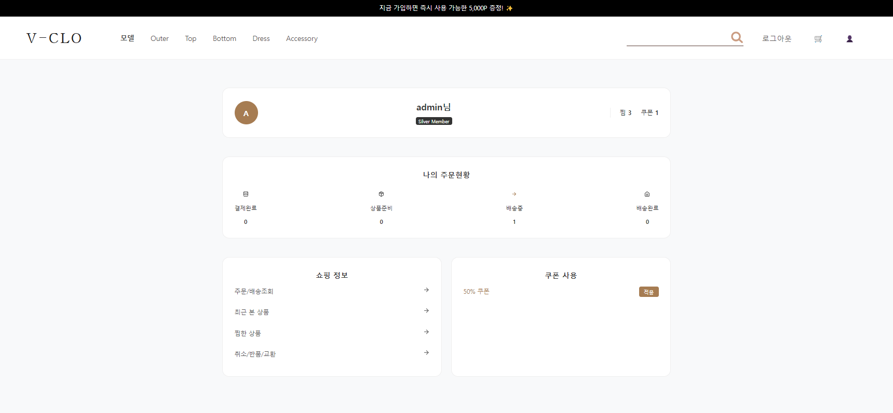
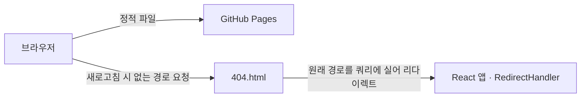

# 👗 V-CLO — 의류 쇼핑몰 "5인의 옷장"

## 프로젝트 소개

KDT 부트캠프 첫 팀 프로젝트. React 기반으로 상품 탐색부터 결제까지 이어지는 의류 쇼핑몰 프론트엔드를 구현했습니다.

| 항목 | 내용 |
|------|------|
| 기간 | 2026.01 ~ 2026.02 |
| 인원 | 5명 |
| 개인 배포 | [https://jeongbyeongmug.github.io/v-clo-frontend/](https://jeongbyeongmug.github.io/v-clo-frontend/) |
| 테스트 계정 | ID: `admin` / PW: `1234` |
| 팀 저장소 | [KDT07/V-CLO](https://github.com/KDT07/V-CLO) |
| 기술 | React 19 · Vite · React Router v7 · styled-components · Axios · GitHub Pages(gh-pages) |

<details>
  <summary><h3>서비스 화면 보기</h3></summary>

| 홈 | 사이드바 |
|---|---|
|  |  |

| 장바구니 | 결제 |
|---|---|
|  |  |

| 마이페이지 |
|---|
|  |

</details>

<br/>

## 담당 역할

장바구니(주담당) · 결제 페이지 · 마이페이지 일부 · 사이드바 · 메인 Section을 담당했습니다.

### 🛒 장바구니 (주담당)
- **장바구니 유지** : `localStorage` 동기화로 새로고침 후에도 장바구니 유지
- **체크박스 선택 결제** : 선택한 상품만 결제 금액에 반영
- **결제 요약** : 쿠폰 할인 · 배송비 · 적립 예정 포인트(1%) 요약 표시
- **불변 업데이트** : 상태 갱신은 새 배열로 교체 — React가 변경을 감지하지 못하는 문제 방지
- **수량 하한** : `Math.max(1, …)`로 하한 강제

### 💳 결제
- **쿠폰 + 포인트 복합 할인** : 쿠폰과 포인트를 함께 쓰는 할인 로직
- **음수 결제 차단** : **포인트 사용액이 쿠폰 적용 후 남은 결제 금액을 초과하지 못하도록 상한 처리**

### 👤 마이페이지
- **탭 분리** : 주문 현황 · 배송 조회(모달) · 취소/반품 · 최근 본 상품 · 찜 목록을 탭으로 분리

### 🧭 사이드바 (플로팅 내비게이션)
- **검색·필터** : 스타일 검색 + 아코디언 필터 6종(색상·종류·배송·소재·핏·무드), 가격·할인율 슬라이더
- **My Picks** : 미니 찜 카드 + 뱃지 카운트, 외부 채널(네이버톡·카카오톡) 새 탭 연결
- **이동·가드** : 최상단/최하단 스크롤 버튼, 비로그인 시 로그인 페이지로 가드

<br/>

## ⌘ 기술 스택

### 언어 (Language)
[](https://developer.mozilla.org/docs/Web/JavaScript)

### 프론트엔드 (Frontend)
[](https://react.dev/)
[](https://reactrouter.com/)
[](https://styled-components.com/)
[](https://axios-http.com/)
[](https://vitejs.dev/)

### 배포 (Deploy)
[](https://pages.github.com/)

### 형상관리 & 협업 (Collaboration)
[](https://git-scm.com/)
[](https://github.com/)

<br/>

## 시스템 구성



정적 호스팅인 GitHub Pages가 빌드 결과물을 내려주고, 클라이언트 라우팅은 React Router가 브라우저 안에서 처리합니다. 새로고침으로 서버에 없는 경로가 요청되면 404.html이 원래 경로를 쿼리 파라미터에 실어 앱 루트로 돌려보내는 구조입니다(상세는 아래 트러블슈팅).

<br/>

## 프로젝트 구조

<details>
  <summary><h3>프로젝트 구조 보기</h3></summary>

```
src/
├─ components/    # Cart, PayMent, MyPage, SideBar, Section
├─ context/       # ProductContext
├─ data/          # Product.json, reviews.json
├─ styles/
├─ App.jsx        # 라우팅 & 장바구니 상태
└─ main.jsx
```

</details>

<br/>

## ⚡트러블 슈팅

### GitHub Pages에서 새로고침하면 404가 뜨던 문제

<details>
<summary>1. 문제점 (Problem)</summary>

<br>

BrowserRouter 기반 SPA를 GitHub Pages에 배포하자, 링크 이동은 정상인데 `/payment` 같은 경로에서 새로고침하거나 URL을 직접 입력하면 404가 떴습니다.

</details>

<details>
<summary>2. 원인 (Cause)</summary>

<br>

링크 이동은 React Router가 브라우저 안에서 처리하지만, 새로고침은 서버에 해당 경로의 파일을 직접 요청합니다. 정적 호스팅인 GitHub Pages에는 그 경로의 파일이 없으므로 404. 클라이언트 라우팅과 정적 호스팅은 라우팅 주체가 다르다는 것이 본질이었습니다.

</details>

<details>
<summary>3. 해결 과정 (Solution)</summary>

<br>

HashRouter(간단하지만 URL에 `/#/`가 남음) 대신, GitHub Pages SPA 배포에서 널리 쓰이는 **404.html 리다이렉트 기법**(rafgraph의 spa-github-pages 방식 참고)을 프로젝트 구조에 맞게 구현했습니다. 404.html이 원래 경로를 쿼리 파라미터에 실어 앱 루트로 돌려보내고, 앱 로드 후 `RedirectHandler`가 `navigate(..., { replace: true })`로 원래 페이지에 복귀시킵니다.

</details>

<details>
<summary>4. 결과 및 배운 점 (Result & Learnings)</summary>

<br>

팀 저장소와 별개로 개인 저장소에 재배포하자 같은 문제가 재발했습니다. 404.html과 RedirectHandler에 저장소 경로가 하드코딩되어 있었기 때문입니다. 경로를 수정해 복구했고, 배포 경로처럼 환경에 따라 달라지는 값은 `vite.config.js`의 `base` 한 곳에서 관리하고 `import.meta.env.BASE_URL`로 참조해야 한다는 교훈을 얻었습니다(리팩토링은 개선 과제).

상세 과정은 [포트폴리오 상세 페이지](https://github.com/jeongbyeongmug)에 정리했습니다.

</details>

<br/>

## 협업

5명이 개인 브랜치에서 작업하고 PR(#40~#52)로 `combine` 브랜치에 병합했습니다. 라우팅과 전역 상태가 모인 `App.jsx`에서 충돌이 잦아, PR 전에 combine을 먼저 당겨와 로컬에서 충돌을 해결하고 올리는 규칙으로 운영했습니다. 장바구니가 참조하는 전역 상품 데이터(ProductContext, Product.json) 구조가 바뀌면 장바구니가 깨지는 문제는 주고받는 데이터 형식을 팀 차원에서 합의해 해결했습니다.

<br/>

## 회고

첫 팀 프로젝트라 완성도보다 협업과 상태 설계 경험에 집중했습니다. 장바구니 상태를 App.jsx에서 props로 내려보내는 구조가 규모가 커지며 prop drilling으로 이어졌고, Context나 상태 관리 라이브러리로 옮겼어야 한다는 것이 가장 큰 배움입니다.
